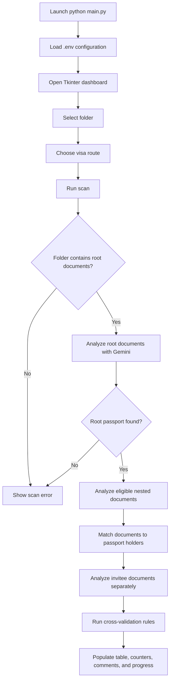
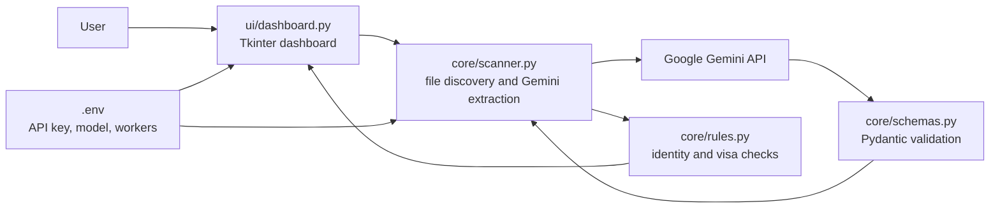

After a scan, open the **Financial report** tab for a financial summary. Every applicant passport found in the selected folder root receives a summary row, including applicants without a bank statement. The report compares adjacent opening and closing balances, estimates stability from extracted closing balances, lists Gemini-identified sudden deposits and every extracted credit greater than 50,000 from the last three months, records zero-balance periods, spending, and savings.
# VisaVerifier

VisaVerifier is a Windows desktop application for reviewing visa application documents. It uses Google Gemini to identify and extract document data, groups documents by passport holder, and reports identity, address, translation, anomaly, and route-specific findings in a Tkinter dashboard.

> **Important:** VisaVerifier provides an automated review aid. It does not replace an immigration adviser, embassy checklist, or official visa decision.

## Features

- Scan a selected folder and its supported subfolders.
- Extract document type, applicant names, passport number, address, related names, language, translation status, financial values, and anomalies.
- Group documents around passport documents found in the selected folder root.
- Cross-check names, passport numbers, addresses, and names printed on documents.
- Detect first/last name order differences and report them as informational findings.
- Check certified translations for foreign-language documents.
- Apply route-specific checks, including the Schengen medical coverage threshold.
- Process documents concurrently with progress reporting.
- Review document-level and applicant-group findings in the desktop dashboard.
- Review a separate financial report for applicants and invitees, including balance carry-forward, stability, recent deposits, zero-balance periods, spending, and savings.
- Generate and open a professional PDF report containing Gemini's executive summary, scan comments, verification findings, and financial statement details.

## Requirements

- Windows with Python 3.10 or newer.
- A Google Gemini API key with access to a supported Gemini model.
- Internet access while a scan is running.
- The Python packages listed in `requirements.txt`.

## Installation

Open PowerShell in the project folder and run:

```powershell
python -m venv .venv
.\.venv\Scripts\Activate.ps1
python -m pip install --upgrade pip
python -m pip install -r requirements.txt
```

Create a file named `.env` in the project root. Do not commit this file or expose the key in screenshots, logs, or source control.

```dotenv
GEMINI_API_KEY=your_gemini_api_key
# Optional: override the default model
GEMINI_MODEL=gemini-flash-latest
# Optional: number of concurrent document requests (default: 4)
SCAN_WORKERS=8
```

## Start the application

```powershell
python main.py
```

The dashboard opens with these controls:

| Control | Action |
| --- | --- |
| Browse folder | Select the application folder to scan. `Ctrl+O` also opens the folder picker. |
| Visa route | Choose `Schengen`, `UK Visit`, or `Canada Visitor`. |
| Run scan | Upload and analyze eligible files using Gemini. `F5` also starts a scan. |
| Generate PDF report | Send the completed scan comments and financial details to Gemini, create a formatted PDF in the selected folder, and open it. |
| Stop scan | Stop the active scan from the toolbar. Queued documents are cancelled and partial results are not displayed as complete. |
| Clear results | Remove the current table and counters. |

After a scan, open the **Financial report** tab for a financial summary. Each applicant or invitee with a detected bank statement receives a summary row and a detailed report. The report compares adjacent opening and closing balances, estimates stability from extracted closing balances, lists Gemini-identified sudden deposits from the last three months, records zero-balance periods, and calculates total deposits, withdrawals, net savings, and savings rate when the source contains enough values. `Insufficient history` and `Not available` mean the statement did not expose enough reliable data for that calculation; they are not negative findings.

## Folder scan format

The selected folder must contain at least one supported document directly in its root, and at least one root-level document must be a passport. The scanner then searches eligible nested folders and associates their documents with a root passport.

Recommended layout:

```text
application-folder/
|-- Alice_Smith_Passport.pdf       # Required: applicant passport in root
|-- Alice_Smith_Bank_Statement.pdf
|-- Alice_Smith_Employment.pdf
|-- Alice_Smith/
|   |-- Alice_Smith_Insurance.pdf
|   `-- Alice_Smith_Birth_Certificate.pdf
|-- invitee/                       # Optional: host/invitee supporting documents
|   |-- Host_Passport.pdf
|   `-- Invitation_Letter.pdf
`-- misc/                          # Ignored by the scanner
	`-- unrelated-file.pdf
```

### Supported files

The scanner accepts these extensions, case-insensitively:

```text
.pdf  .png  .jpg  .jpeg  .webp  .heic
```

Other files are ignored. The `misc` directory and its contents are excluded. A directory named `invitee` is the exception: its supported files are scanned separately as invitee/host documents and are not treated as applicant documents.

### How documents are grouped

1. Root-level supported files are analyzed first.
2. Root passports become applicant holders. If no passport is found in the root, the scan stops with an error.
3. Nested non-`misc`, non-`invitee` documents are matched to a holder using this priority:
   - matching passport number;
   - applicant name found in the filename;
   - shared names extracted from the document and passport.
4. Ambiguous or unmatched nested documents are not added to an applicant group.
5. Files under `invitee` are analyzed as a separate supporting group. An invitee passport is optional and does not satisfy the applicant passport requirement.

For reliable matching, use filenames containing the applicant name and keep passport numbers readable in the documents.

## Verification checks

For each applicant group, the application can report:

- Missing applicant passport.
- Applicant name mismatch or first/last name order difference.
- Passport number mismatch.
- Address mismatch using normalized address, place, postal-code, and meaningful-token comparisons.
- Unexpected names printed on a document.
- Anomalies returned by Gemini.
- Foreign-language documents without a certified translation.
- For `Schengen`, missing insurance or coverage below EUR 30,000.

Invitee-only groups receive anomaly and translation checks, but identity checks are not applied against an applicant passport.

## Application flow



## System block diagram



## Extracted document format

Gemini responses are validated against the `ExtractedDocument` schema before they are used by the rules engine. A document contains fields equivalent to:

```json
{
  "document_type": "Passport",
  "applicant_name": "Alice Smith",
  "passport_number": "P1234567",
  "address": "10 Example Street, London",
  "names_on_document": ["Alice Smith"],
  "passport_related_names": ["Robert Smith"],
  "source_filename": "Alice_Smith_Passport.pdf",
  "is_invitee_document": false,
  "is_foreign_language": false,
  "has_certified_translation": false,
  "financial_balance_eur": null,
  "anomalies_detected": []
}
```

The application also defines an `ApplicationVerificationResult` model containing `destination`, `documents`, `critical_flags`, and `ready_for_submission` for future structured result export. The current dashboard displays results directly and does not write a result file.

## Configuration

| Variable | Required | Default | Description |
| --- | --- | --- | --- |
| `GEMINI_API_KEY` | Yes | None | API credential used by the Gemini client. |
| `GEMINI_MODEL` | No | `gemini-flash-latest` | First model attempted for extraction. |
| `SCAN_WORKERS` | No | `8` | Maximum concurrent extraction workers, capped at 16 to avoid uncontrolled API pressure. |

The scanner retries selected API and HTTP failures and tries configured fallback Gemini models. A scan can still fail when the API key is invalid, quota is exhausted, files cannot be read, or all model attempts fail.

## Troubleshooting

**`GEMINI_API_KEY` warning**

Confirm that `.env` is in the same directory as `main.py`, that the variable name is exact, and that the key is valid.

**No supported documents found**

Put at least one `.pdf`, `.png`, `.jpg`, `.jpeg`, `.webp`, or `.heic` file directly in the selected folder. Files only inside `misc` or `invitee` do not satisfy the root-document requirement.

**No passport documents found in the selected folder root**

Place each applicant passport directly in the selected folder, not only in a nested applicant folder. The passport document type or filename must identify it as a passport.

**Documents are not grouped with an applicant**

Ensure the document contains a matching passport number, a readable applicant name, or a filename containing the passport holder's name. Unclear or conflicting identity data may remain unmatched.

**Scan is slow or fails intermittently**

The application sends document contents to Gemini. Check connectivity and quota, reduce `SCAN_WORKERS` if the API is being rate-limited, and review the status message shown in the dashboard.

## Project structure

```text
VisaVerifier/
|-- main.py                  # Application entry point
|-- requirements.txt         # Python dependencies
|-- core/
|   |-- scanner.py           # Discovery, extraction, grouping, retries
|   |-- rules.py             # Cross-document verification rules
|   `-- schemas.py           # Pydantic document/result models
`-- ui/
	`-- dashboard.py         # Tkinter desktop interface
```

## Privacy and security

Documents are read from disk and sent to the configured Google Gemini API for analysis. Only scan documents you are authorized to process, review your organization's data-handling requirements, and remove API keys from any shared files. Do not place secrets in the README or commit `.env` to source control.
